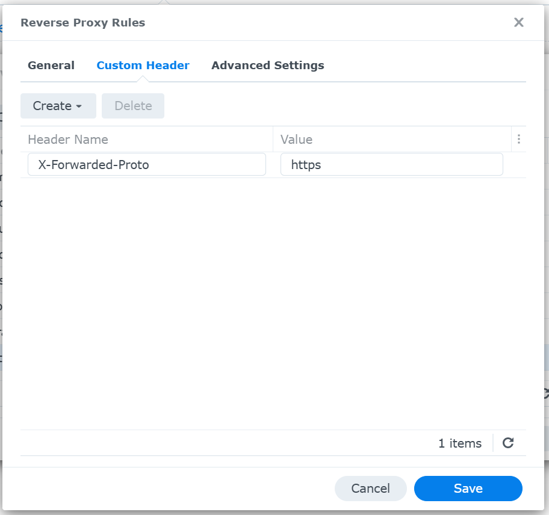

# Déploiement sur un NAS Synology

## Vue d'ensemble

```
GitHub (push sur main)
  └── CI build l'image Docker, la publie sur ghcr.io (tag `latest`)

NAS Synology
  └── Portainer : stack Git pointant sur docker-compose.yml du repo
        ├── pull l'image web depuis ghcr.io (pas de build sur le NAS)
        ├── variables d'env fournies via l'UI Portainer (pas de .env committé)
        └── données persistantes en bind-mount sous ${STORAGE_DIR}/data/
            (ex: /volume1/docker/studymed/data/), indépendant du dossier
            interne où Portainer clone le repo

DSM (reverse-proxy) : termine le TLS, route vers le port nginx du stack
```

Le NAS ne build jamais l'image : c'est la CI GitHub qui s'en charge et la publie sur `ghcr.io/camille626/entrainement-medecine:latest` à chaque push sur `main`. Portainer n'a qu'à la pull.

`docker-compose.yml` distingue deux types de fichiers :
- les **données persistantes** (`data/postgres`, `data/media`, `data/static`) sont montées via `${STORAGE_DIR}/data/...`, un chemin absolu fourni en variable d'environnement (voir étape 3) — indépendant du stack Portainer, donc les données survivent même si le stack est supprimé puis recréé.
- la **config nginx** (`docker/nginx.conf`) reste en chemin relatif (`./docker/nginx.conf`) : elle vient du repo cloné par Portainer et doit donc rester synchronisée avec le code, pas figée dans un dossier à part.

## 1. CI/CD — publication de l'image

Le workflow `.github/workflows/docker-publish.yml` build et push l'image sur ghcr.io à chaque push sur `main` touchant le code applicatif (`Dockerfile`, `config/`, `qcm/`, `pyproject.toml`, etc.).

Le package est public dès le premier push (il hérite de la visibilité publique du dépôt), donc le NAS peut le pull sans authentification. À vérifier si besoin sur la page du package (lien "Packages" dans la sidebar du repo) > **Package settings** > section **Danger Zone** > **Change package visibility**.

## 2. Structure sur le NAS

Choisir un dossier de stockage pour les données persistantes, ex: `/volume1/docker/studymed`. Pas besoin de créer les sous-dossiers à l'avance : Docker les crée automatiquement au premier démarrage (`data/postgres/`, `data/media/`, `data/static/` sous ce dossier).

| Dossier                                                | Monté dans                  | Contenu                                        |
| ------------------------------------------------------ | --------------------------- | ---------------------------------------------- |
| `${STORAGE_DIR}/data/postgres/`                        | conteneur `db`              | données PostgreSQL                             |
| `${STORAGE_DIR}/data/media/`                           | conteneurs `web` et `nginx` | fichiers uploadés (images, certificats)        |
| `${STORAGE_DIR}/data/static/`                          | conteneurs `web` et `nginx` | fichiers statiques collectés (`collectstatic`) |
| `docker/nginx.conf` (relatif, dans le clone Portainer) | conteneur `nginx`           | config nginx, vient du repo                    |

## 3. Créer le stack dans Portainer

**Stacks** > **Add stack** > **Repository** :

- Repository URL : `https://github.com/camille626/entrainement-medecine`
- Repository reference : `refs/heads/59-déploiement-docker-nas-privé-+-cloud-public-avec-sync-de-données`
- Compose path : `docker-compose.yml`
- **Environment variables** : saisir dans l'UI (ou charger depuis un `.env` local au poste qui ouvre Portainer) :

| Variable                                              | Valeur pour ce déploiement                              |
| ----------------------------------------------------- | ------------------------------------------------------- |
| `DJANGO_SECRET_KEY`                                   | une longue chaîne aléatoire générée                     |
| `DJANGO_DEBUG`                                        | `False`                                                 |
| `DJANGO_ALLOWED_HOSTS`                                | `studymed.ascot63.synology.me`                          |
| `DJANGO_CSRF_TRUSTED_ORIGINS`                         | `https://studymed.ascot63.synology.me`                  |
| `POSTGRES_DB` / `POSTGRES_USER` / `POSTGRES_PASSWORD` | identifiants de la base                                 |
| `NGINX_PORT`                                          | port interne choisi, ex: `9666`                         |
| `STORAGE_DIR`                                         | `/volume1/docker/studymed` (dossier choisi à l'étape 2) |

Déployer le stack : Portainer clone le repo, lit `docker-compose.yml`, pull l'image `web` depuis ghcr.io, et démarre les 3 services.

Pour générer `DJANGO_SECRET_KEY` :

```bash
python3 -c "import secrets; print(secrets.token_urlsafe(50))"
```

## 3'. Créer le stack sous l'hôte dans `/tmp` pour tester

Équivalent de l'étape 3, mais en local (sans Portainer ni NAS) pour valider la stack avant un vrai déploiement. Depuis une checkout du repo sur un host avec Docker (pas dans le devcontainer — voir [Note sur les tests en devcontainer](#note-sur-les-tests-en-devcontainer)). Utiliser un fichier d'env séparé (`.env.local_temp`, ignoré par git) plutôt que `.env`, pour ne pas écraser la config de prod déjà en place :

`.env.local_temp` doit contenir au moins `DJANGO_ALLOWED_HOSTS=localhost,127.0.0.1`, `STORAGE_DIR=/tmp/studymed`, `NGINX_PORT=8081` (ou un port libre), plus les autres secrets habituels. Repartir de `.env.example` si nécessaire

```bash
source .env.local_temp   # pour pouvoir réutiliser $NGINX_PORT / $STORAGE_DIR ci-dessous

docker compose --env-file .env.local_temp up -d
docker compose ps
curl -I http://localhost:$NGINX_PORT/   # doit répondre 302 vers /login/
ls $STORAGE_DIR/data/                   # postgres/ media/ static/
```

Pour tester une modification de code locale avant qu'elle soit publiée par la CI (`docker-compose.yml` ne déclare pas de `build:`, voir [Référence : architecture des conteneurs](#reference-architecture-des-conteneurs)), builder et tagger l'image manuellement avant le `docker compose up` :

```bash
docker build -t ghcr.io/camille626/entrainement-medecine:latest .
docker compose --env-file .env.local_temp up -d
```

Nettoyage après test :

```bash
docker compose --env-file .env.local_temp down

# Garde-fou : refuse si STORAGE_DIR est vide ou hors /tmp.
if [[ -n "$STORAGE_DIR" && "$STORAGE_DIR" == /tmp/* ]]; then
  # rm/rmdir directs côté host échouent souvent : fichiers possédés par l'UID
  # du conteneur (ex: postgres), et le dossier $STORAGE_DIR lui-même a été créé
  # par Docker (root) — le sticky bit de /tmp empêche un user non-root de le
  # supprimer même vide. On monte le parent (/tmp) dans un conteneur jetable
  # et on supprime tout depuis là, en root.
  docker run --rm -v /tmp:/host_tmp alpine rm -rf "/host_tmp/$(basename "$STORAGE_DIR")"
else
  echo "STORAGE_DIR non défini ou hors /tmp ($STORAGE_DIR) — suppression annulée." >&2
fi
```

### Note sur les tests en devcontainer

Si ce repo est ouvert dans son propre devcontainer (`docker-in-docker`), le daemon Docker imbriqué peut se dégrader après une session longue (plusieurs heures, beaucoup de créations/suppressions de réseaux et conteneurs) et casser la connectivité réseau entre conteneurs (`connection timed out` entre `web` et `db` alors que tout démarre normalement). Dans ce cas, tester directement sur la machine hôte (hors devcontainer) plutôt que de chercher un bug dans `docker-compose.yml` — un redémarrage du daemon Docker du devcontainer (ou un rebuild du devcontainer) résout généralement le problème.

## 4. Configurer le reverse-proxy DSM

**Panneau de configuration** > **Portail de connexion** > **Avancé** > **Reverse Proxy** > **Créer** :

- Source : `studymed.ascot63.synology.me`, HTTPS, port 443
- Destination : `localhost`, HTTP, port `9666` (le `NGINX_PORT` choisi à l'étape 3)

**Ajouter un en-tête personnalisé** (onglet "En-tête personnalisé" de la règle) : `X-Forwarded-Proto: https`. Le conteneur `nginx` du stack relaie cet en-tête vers Django (au lieu de le forcer en dur, ce qui casserait les tests en HTTP direct — voir [Note de sécurité](#note-de-securite)) ; sans cet en-tête envoyé par DSM, Django croira que la connexion est en HTTP même derrière le HTTPS de DSM.



Vérifier aussi dans **Panneau de configuration** > **Sécurité** > **Certificat** que `studymed.ascot63.synology.me` a un certificat HTTPS valide associé.

## 5. Initialiser l'application

`docker compose exec <service>` résout automatiquement le bon conteneur du stack courant — pas besoin de connaître son nom exact (qui dépend du nom donné au stack dans Portainer). Depuis le dossier où vit `docker-compose.yml` (en SSH, ou via la Console d'un conteneur dans Portainer), peupler la base Postgres avec les données existantes — via l'ORM Django (`dumpdata`/`loaddata`) depuis le SQLite source (`db.sqlite3` du dev local), pas de copie binaire du fichier SQLite (les formats sont incompatibles avec Postgres) :

1. **Exporter** depuis la base SQLite source :

   ```bash
   uv run --active python manage.py dumpdata qcm auth --output=fixture.json
   ```

2. **Copier** le fichier JSON dans `${STORAGE_DIR}/data/media/` (vu par le conteneur `web` comme `/app/media/`). Un `cp` direct échoue (`Permission denied`) : ce dossier appartient à l'UID du conteneur (`app`), pas à l'utilisateur de l'hôte — on passe par un conteneur jetable (root) :

   ```bash
   docker run --rm \
     -v "$STORAGE_DIR/data/media":/target \
     -v "$(pwd)/fixture.json":/src/fixture.json:ro \
     alpine cp /src/fixture.json /target/
   ```

3. **Importer** depuis le conteneur `web`, qui est connecté au Postgres de la stack via `DATABASE_URL` :

   ```bash
   docker compose exec web python manage.py loaddata /app/media/fixture.json
   ```

À ne lancer qu'une fois sur une base Postgres vierge (juste après `migrate`, avant toute utilisation) — `loaddata` ne gère pas les conflits si des données existent déjà avec les mêmes clés primaires.

## 6. Tester

`https://studymed.ascot63.synology.me` doit afficher l'application, et la connexion/inscription doit fonctionner sans erreur CSRF.

## Mises à jour ultérieures

1. Un push sur `main` republie automatiquement l'image `latest` sur ghcr.io.
2. Dans Portainer : **Stacks** > `studymed` > **Pull and redeploy** (ou re-déployer le stack) pour récupérer la nouvelle image et redémarrer les conteneurs.

Les migrations et le `collectstatic` sont rejoués automatiquement par `entrypoint.sh` à chaque redémarrage du conteneur `web`.

## Sauvegarde de la base de données

```bash
docker compose exec db pg_dump -U "$POSTGRES_USER" "$POSTGRES_DB" > backup.sql
```

`${STORAGE_DIR}/data/postgres/` étant un dossier normal sur le NAS, il peut aussi être sauvegardé directement (Hyper Backup, snapshot du volume...) en plus des dumps SQL réguliers.

## Note de sécurité

`NGINX_PORT` (ex: `9666`) **ne doit jamais être exposé directement sur Internet** (pas de redirection de port sur la box/routeur vers ce port) — seul le port 443 du reverse-proxy DSM doit être accessible depuis l'extérieur. Le conteneur `nginx` relaie tel quel le `X-Forwarded-Proto` reçu de son appelant (DSM en prod) sans le forcer en dur, pour ne pas casser les tests en HTTP direct (sinon Django croit la connexion HTTPS alors que le `Referer` du navigateur est en `http://`, et rejette le CSRF). Si ce port était exposé directement, n'importe qui pourrait usurper une connexion "sécurisée" auprès de Django en envoyant lui-même cet en-tête.

## Référence : architecture des conteneurs

```
nginx (reverse-proxy interne, port ${NGINX_PORT:-8080})
  ├── sert /static/ et /media/ directement (bind-mounts ${STORAGE_DIR}/data/static, ${STORAGE_DIR}/data/media)
  └── proxy_pass tout le reste vers web:8000
web (gunicorn + Django, image ghcr.io/camille626/entrainement-medecine:latest)
db (postgres:17-alpine, bind-mount ${STORAGE_DIR}/data/postgres)
```

`STORAGE_DIR` vaut `.` par défaut (donc `./data/...`, relatif au repo — pratique en local) ; en valeur absolue (ex: `/volume1/docker/studymed`) pour un déploiement Portainer, où il faut que les données survivent à une éventuelle suppression/recréation du stack.

Le `Dockerfile` est multi-stage :

- stage `builder` : installe les dépendances avec `uv sync --frozen --no-dev`
- stage `runtime` : copie l'environnement virtuel et le code depuis `builder`, tourne avec un utilisateur non-root

Au démarrage du conteneur `web`, `entrypoint.sh` exécute `migrate --noinput` puis `collectstatic --noinput` avant de lancer la commande passée (`gunicorn` par défaut).

`docker-compose.yml` ne déclare que `image:` (pas de `build:`) sur le service `web` : `docker compose up`/Portainer pull systématiquement depuis ghcr.io, jamais de build sur le NAS. Pour tester une modification de code en local avant qu'elle soit publiée par la CI, builder et tagger l'image manuellement avant `docker compose up` :

```bash
docker build -t ghcr.io/camille626/entrainement-medecine:latest .
docker compose up -d
```

## Référence : variables d'environnement

| Variable                                              | Rôle                                                                                                                              |
| ----------------------------------------------------- | --------------------------------------------------------------------------------------------------------------------------------- |
| `DJANGO_SECRET_KEY`                                   | Clé secrète Django (à générer, ne jamais committer)                                                                               |
| `DJANGO_DEBUG`                                        | `False` en production                                                                                                             |
| `DJANGO_ALLOWED_HOSTS`                                | Liste des hôtes autorisés, séparés par des virgules                                                                               |
| `DJANGO_CSRF_TRUSTED_ORIGINS`                         | Origines autorisées pour les requêtes POST, avec le schéma (ex: `https://studymed.ascot63.synology.me`)                           |
| `POSTGRES_DB` / `POSTGRES_USER` / `POSTGRES_PASSWORD` | Identifiants de la base PostgreSQL                                                                                                |
| `NGINX_PORT`                                          | Port interne sur lequel nginx écoute (mappé par docker-compose, défaut `8080`)                                                    |
| `STORAGE_DIR`                                         | Dossier de base des données persistantes (défaut `.`, relatif — à fixer en absolu pour Portainer, ex: `/volume1/docker/studymed`) |

Le `DATABASE_URL` utilisé par le service `web` est construit automatiquement dans `docker-compose.yml` à partir des variables `POSTGRES_*` (pas besoin de le dupliquer dans `.env`).
